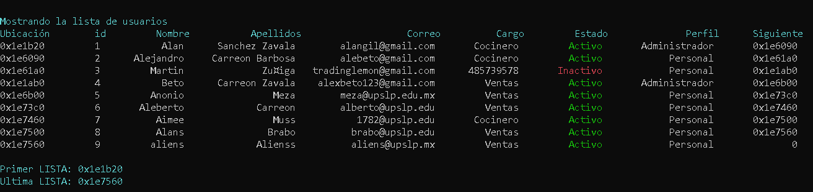

Multi-Level Circular Logistics Engine

Sistema avanzado de administración de rutas y usuarios diseñado para optimizar la logística de transporte mediante estructuras de datos dinámicas en C++.

Características Principales
* **Arquitectura de Lista de Listas:** Implementación de una lista maestra de usuarios donde cada nodo contiene una sub-lista dinámica de rutas personalizadas.
* **Persistencia Indexada:** Generación dinámica de archivos `.xls` basados en el ID del usuario para una carga selectiva de datos.
* **Data Sanitization:** Módulo de validación robusto para prevenir desbordamientos de búfer y asegurar la integridad de las entradas (tipado fuerte).
* **UI en Consola:** Interfaz tabular alineada con manejo de colores para estados de sistema (Activo/Inactivo/Alerta).

 Detalles Técnicos
Estructuras de Datos
* **Nodos Circulares:** Implementación de punteros para navegación cíclica en rutas.
* **Gestión de Memoria:** Uso intensivo de `new` y `delete` para asignación dinámica, minimizando el uso de memoria estática.
* **Mapeo de Archivos:** Serialización y deserialización manual de objetos complejos mediante `stringstream`.

Estructura del Proyecto
* `libreria.h`: Definición de structs (Usuario, Rutas, Horario) y dependencias.
* `archivo.h`: Motor de persistencia individual por usuario.
* `funcionesMisRutas.h`: Lógica de negocio para el CRUD de itinerarios.
* `validaciones.h`: Capa de seguridad para entrada de datos.
* `principal.cpp`: Punto de entrada y configuración del entorno.
